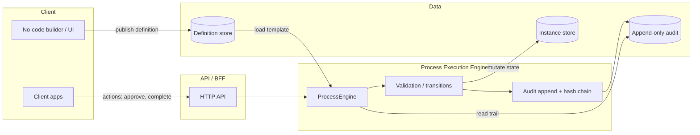

# Part 1 — Data modeling, state machine, audit trail, architecture

This document satisfies **`docs/architecture.md`** (assignment: architecture as png | pdf | **md**). The **implementation** is in-memory TypeScript (`src/models/`); the **schema below** is the relational shape a production service would persist, aligned with the same domain types.

---

## 1. Data model (PostgreSQL-oriented)

### Design principles

- **Definition vs instance:** Definitions are **templates** (versionable, configured in a no-code builder). Instances are **runtime executions** with concrete state, fields, and audit history. Instances **reference** a specific definition version and never mutate definition rows.
- **Normalization:** Steps and transitions live with the definition; per-instance step state and field values are separate tables (or JSONB columns if you accept trade-offs for flexibility).

### `CREATE TABLE` sketch

```sql
-- Tenant / customer scope (multi-tenant eQMS)
CREATE TABLE tenant (
  id          UUID PRIMARY KEY,
  name        TEXT NOT NULL
);

-- Published process definition (immutable row per version)
CREATE TABLE process_definition (
  id              UUID PRIMARY KEY,
  tenant_id       UUID NOT NULL REFERENCES tenant(id),
  definition_key  TEXT NOT NULL,       -- stable id from builder, e.g. 'capa'
  version         INT  NOT NULL,
  name            TEXT NOT NULL,
  published_at    TIMESTAMPTZ NOT NULL DEFAULT now(),
  UNIQUE (tenant_id, definition_key, version)
);

CREATE TABLE step_definition (
  id                  UUID PRIMARY KEY,
  process_definition_id UUID NOT NULL REFERENCES process_definition(id) ON DELETE CASCADE,
  step_key            TEXT NOT NULL,
  name                TEXT NOT NULL,
  step_order          INT NOT NULL,
  step_type           TEXT NOT NULL,   -- task, approval, parallel_approval, checklist, ...
  assignee_rule       JSONB NOT NULL, -- { type, value?, userIds? }
  fields              JSONB NOT NULL DEFAULT '[]',
  cross_field_rules   JSONB NOT NULL DEFAULT '[]',
  checklist_items     JSONB,
  required_approvers  JSONB,
  escalation          JSONB,
  UNIQUE (process_definition_id, step_key)
);

CREATE TABLE transition_rule (
  id                   UUID PRIMARY KEY,
  process_definition_id UUID NOT NULL REFERENCES process_definition(id) ON DELETE CASCADE,
  from_step_key        TEXT NOT NULL,
  to_step_key          TEXT NOT NULL,
  action               TEXT NOT NULL,
  condition            JSONB,         -- nullable field-based condition
  priority             INT NOT NULL DEFAULT 0
);

-- Running instance (pins definition version)
CREATE TABLE process_instance (
  id                   UUID PRIMARY KEY,
  tenant_id            UUID NOT NULL REFERENCES tenant(id),
  process_definition_id UUID NOT NULL REFERENCES process_definition(id),
  status               TEXT NOT NULL,  -- active, completed, cancelled, suspended
  initiated_by_user_id TEXT NOT NULL,
  current_step_key     TEXT NOT NULL,
  instance_fields      JSONB NOT NULL DEFAULT '{}',
  created_at           TIMESTAMPTZ NOT NULL DEFAULT now(),
  updated_at           TIMESTAMPTZ NOT NULL DEFAULT now()
);

CREATE TABLE step_instance (
  id                 UUID PRIMARY KEY,
  process_instance_id UUID NOT NULL REFERENCES process_instance(id) ON DELETE CASCADE,
  step_key           TEXT NOT NULL,
  status             TEXT NOT NULL,
  step_fields        JSONB NOT NULL DEFAULT '{}',
  approvals          JSONB NOT NULL DEFAULT '[]',
  checklist_state  JSONB NOT NULL DEFAULT '[]',
  started_at         TIMESTAMPTZ,
  completed_at       TIMESTAMPTZ,
  UNIQUE (process_instance_id, step_key)
);

-- Append-only audit (no UPDATE/DELETE in app; DB triggers or revoked privileges enforce)
CREATE TABLE audit_log (
  id              BIGSERIAL PRIMARY KEY,
  instance_id     UUID NOT NULL REFERENCES process_instance(id),
  sequence_no     BIGINT NOT NULL,      -- monotonic per instance
  step_key        TEXT,
  actor_id        TEXT NOT NULL,
  action          TEXT NOT NULL,
  previous_state  TEXT,
  new_state       TEXT,
  field_changes   JSONB,
  reason          TEXT,
  metadata        JSONB,
  occurred_at     TIMESTAMPTZ NOT NULL DEFAULT now(),
  prev_checksum   BYTEA NOT NULL,       -- hash chain: H(prev_row || this_row_payload)
  row_checksum    BYTEA NOT NULL,
  UNIQUE (instance_id, sequence_no)
);
```

### Indexing strategy

| Table | Index | Why |
|-------|--------|-----|
| `process_definition` | `(tenant_id, definition_key)` | Resolve “latest” or specific version for builder/API. |
| `process_instance` | `(tenant_id, status, updated_at)` | Operational dashboards / open work queues. |
| `process_instance` | `(process_definition_id)` | Analytics per definition type. |
| `step_instance` | `(process_instance_id)` | Load all step state for one instance (hot path). |
| `audit_log` | **`(instance_id, sequence_no)`** | Ordered trail per instance (primary read path). |
| `audit_log` | **`(occurred_at)`** or partition key | Compliance range scans (see `evolution.md` at scale). |

### Definition vs instance (separation)

- **Definition tables** describe what *can* happen; they are edited through publishing new versions, not by mutating running workflows.
- **Instance tables** describe what *is* happening: current step, field values, approval vectors, checklist completion. All **mutations** to instance state go through the engine and produce **audit rows**.

Code mirror: `ProcessDefinition` / `StepDefinition` / `TransitionRule` in [`src/models/types.ts`](../src/models/types.ts) vs `ProcessInstance` / `StepInstance` / in-memory audit arrays in [`src/models/engine.ts`](../src/models/engine.ts).

---

## 2. State machine design

### How transitions are represented

In code, transitions are **data**: an array of `TransitionRule` (`from_step_key`, `to_step_key`, `action`, optional `condition`, `priority`). The engine picks the highest-priority rule whose condition matches instance fields.

**Examples (conceptually same as CAPA in code):**

```text
initiation --complete--> investigation
investigation --complete--> review
review --approve--> implementation        (after parallel approvals satisfied in engine)
review --reject--> investigation
implementation --complete--> effectiveness_check
effectiveness_check --reopen (if is_effective = false) --> investigation
effectiveness_check --approve--> [terminal / complete process]
```

### Enforcing valid transitions

1. **Step must be `in_progress`** and actor must pass **assignee rules** (`checkAuthorization` in engine).
2. **Action** must match a transition from the current step (e.g. cannot `complete` an approval-only step if no such rule exists).
3. **`findTransition`** returns null → **typed error** (`TransitionError` in TS).
4. **Field validation** runs before committing (`validateFields`, cross-field rules).

Implementation: [`src/models/field-ops.ts`](../src/models/field-ops.ts), [`src/models/engine.ts`](../src/models/engine.ts).

### Parallel approvals — when the engine advances

- Each `approve` / `reject` updates that approver’s slot in `step_instance.approvals`.
- **Reject:** any rejection → immediately choose **reject** transition and leave the step.
- **Approve:** advance **only when every** required approver has `approved`; then resolve **approve** transition to the next step.

Implementation: [`src/models/step-handlers.ts`](../src/models/step-handlers.ts).

**Escalation (48h):** modeled on the definition as metadata in the sample CAPA; a production system would use a **scheduler / job queue** to enqueue escalation actions, not the synchronous demo loop.

---

## 3. Audit trail design

### What gets logged

Each state-changing event: **actor**, **action** type, **step** (nullable for process-level events), **previous_state**, **new_state**, optional **field_changes** / **reason**, **timestamp**, and a **cryptographic chain** to the previous entry.

Schema shape matches `AuditEntry` in [`src/models/types.ts`](../src/models/types.ts).

### Immutability

- **RDBMS:** `audit_log` is **append-only**; deny `UPDATE`/`DELETE` to application roles; optional **generated column** + trigger for checksum.
- **In-memory engine:** entries are pushed to an array; **`getAuditTrail`** returns a **copy** so callers cannot mutate internal log.

### Proving non-tampering to an auditor

- **Hash chain:** each entry’s checksum = `H(prev_checksum || canonical_payload)` (implemented in [`src/models/audit-chain.ts`](../src/models/audit-chain.ts)); **`verifyAuditIntegrity`** recomputes and detects any alteration.
- **Production:** add **WORM storage**, **database auditing**, periodic **signed checkpoints** exported to cold storage, and **separation of duties** on who can run migrations.

---

## 4. Architecture diagram (Mermaid)



**Flow for “approve step”:** Client → API → **authorize** → **load instance + definition** → **validate** actor + fields → **apply transition** (possibly waiting on parallel approvals) → **append audit** → **persist instance** → response with `StepResult`.

**Where definitions live:** long-term in **DEF** (Postgres); **evaluated** in memory inside `ProcessEngine` after load. The demo uses [`loadDefinition`](../src/models/engine.ts) on an in-memory `Map` instead of Postgres.

---

## Mapping to repository files

| Topic | Location |
|-------|----------|
| Domain types | `src/models/types.ts` |
| Engine orchestration | `src/models/engine.ts` |
| Transitions / validation | `src/models/field-ops.ts` |
| Parallel + checklist | `src/models/step-handlers.ts` |
| Audit chain + verify | `src/models/audit-chain.ts` |
| CAPA example definition | `src/controllers/example.ts` |
